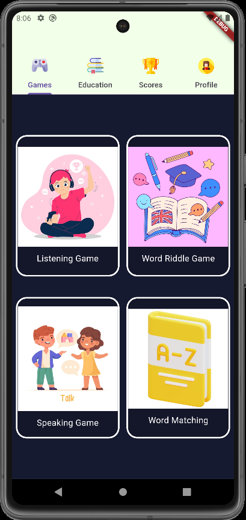
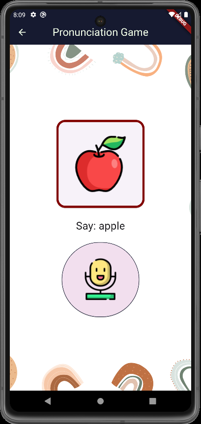
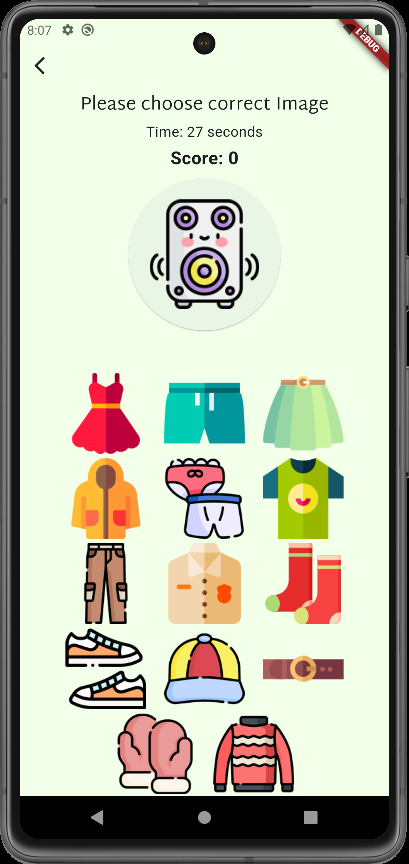
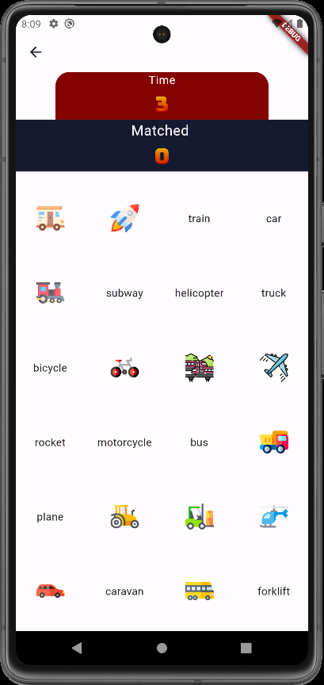

# Word Wonderland


## Overview

**Word Wonderland** is a mobile application developed using Flutter to enhance children's English vocabulary. The app features four mini-games that focus on improving writing, speaking, listening, and matching skills.

## Features

- **Mini-Games**: Four interactive mini-games to enhance different language skills.
  - Writing
  - Speaking
  - Listening
  - Matching
- **Authentication**: Implemented Firebase for user authentication.
- **Database**: Utilized Firestore to store user data and game progress.
- **Engaging Gameplay**: Designed to be both educational and entertaining.
- **User Testing**: Conducted extensive user testing to ensure an intuitive and user-friendly experience.

## Screenshots

Here are some screenshots of the application:

### Home Screen


### Writing Game


### Speaking Game


### Listening Game


### Matching Game


## Installation

To run this project on your local machine:

1. Clone the repository:
   ```sh
   git clone https://github.com/your-username/word-wonderland.git

2. Navigate to the project directory:
   ```sh
   cd word-wonderland

3. Install dependencies:
   ```sh
   flutter pub get

4. Run the app:
   ```sh
   flutter run

## Technologies Used
    - Flutter
    - Firebase Authentication
    - Firestore
    - Dart

## Contributing

Contributions are welcome! Please fork this repository and submit a pull request.
License

This project is licensed under the MIT License - see the LICENSE file for details.
Contact

Ruveyda Kışla - ruveydakisla34@gmail.com


